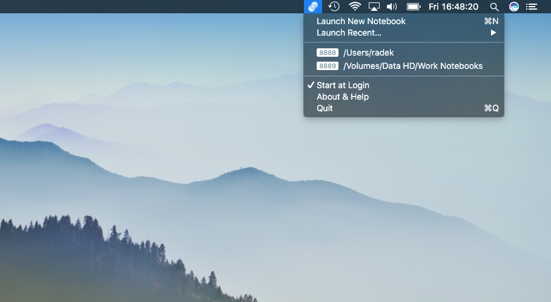

    <h3 align="center"></h3>
    <h1 align="center">Jupyter Notebook Launcher</h1>
    <h4 align="center">Manage Jupyter Notebook servers elegantly from menu bar</h4>

## Know your shortcuts
Action                 | Shortcut
-----------------------| -----------------------
Open server in browser | <kbd>Click</kbd> on server
Shut down server       | <kbd>Alt</kbd> <kbd>Click</kbd> on server
New server             | <kbd>Cmd</kbd> <kbd>N</kbd>
Quit                   | <kbd>Cmd</kbd> <kbd>Q</kbd>

## License
MIT

## Disclaimer
This is a third-party application and is not affiliated with Project Jupyter.
